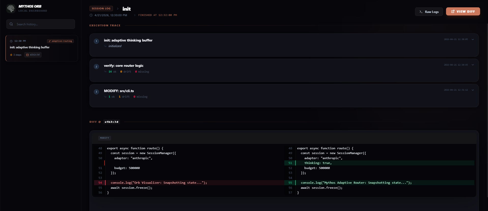
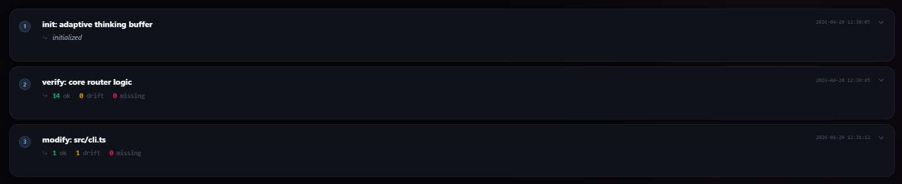
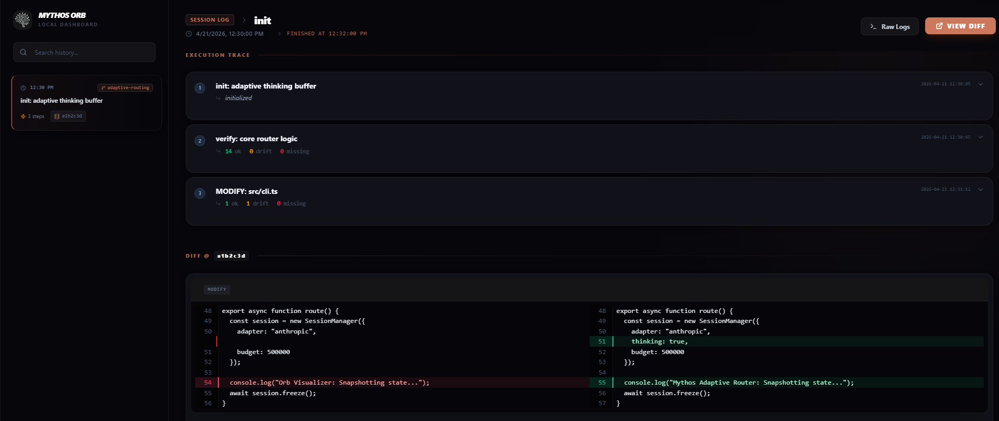

# Mythos Orb

> Local visualization dashboard for parsing Mythos Router MEMORY.md files and SWD protocols.

Mythos Orb is a dashboard built to transform the raw engineering logs of [Mythos Router](https://github.com/thewaltero/mythos-router) into an accessible, searchable, and readable engineering trace. 

It provides real-time insights into adaptive thinking buffers, reality-alignment checks, and codebase mutations—effectively serving as the "flight recorder" for your AI-augmented development sessions.



---

##  Core Systems

### 1. Engineering Trace Exploration
Navigate through sessions with millisecond precision. Every action, verification, and drift detection event is indexed and presented in a sleek, interactive timeline.



### 2. High-Fidelity Diff Visualization
Integrated with Git and the Mythos `SWD` (Strict Write Discipline) protocol, the Orb provides side-by-side diffs that visualize exactly how the model is proposing to mutate your codebase before any write hits the disk.



### 3. Adaptive Thinking Monitor
Watch the model's internal "thinking" state. The Orb surfaces the reasoning steps that lead to specific architectural decisions, giving you full visibility into the "black box" of agentic routing.

---

##  Quick Start

### 1. Clone & Install
```bash
git clone https://github.com/thewaltero/mythos-orb.git
cd mythos-orb
npm install
```

### 2. Launch the Data Engine
The Orb requires a local Fastify server to parse your `MEMORY.md` and interface with Git.
```bash
npm run server
```

### 3. Start the Visualizer
In a separate terminal, launch the Vite dev server:
```bash
npm run dev
```
The dashboard will be active at `http://localhost:5173`.

---

##  Configuration

The server environment can be tuned via several variables:

| Variable | Default | Description |
| :--- | :--- | :--- |
| `MEMORY_PATH` | `../MEMORY.md` | Path to the Mythos Router memory file. |
| `REPO_ROOT` | `dirname(MEMORY_PATH)` | The root of the repository being monitored. |
| `PORT` | `3333` | Internal API port for the Fastify engine. |

---

##  Architecture

- **Frontend**: React 19 + TypeScript + Vite
- **Styling**: Tailwind CSS 4.0 + Lucide React
- **Engine**: Fastify + Node.js (parsing `MEMORY.md` & Git diffs)
- **High-Fi Diffs**: `react-diff-view` + `refractor`

---
